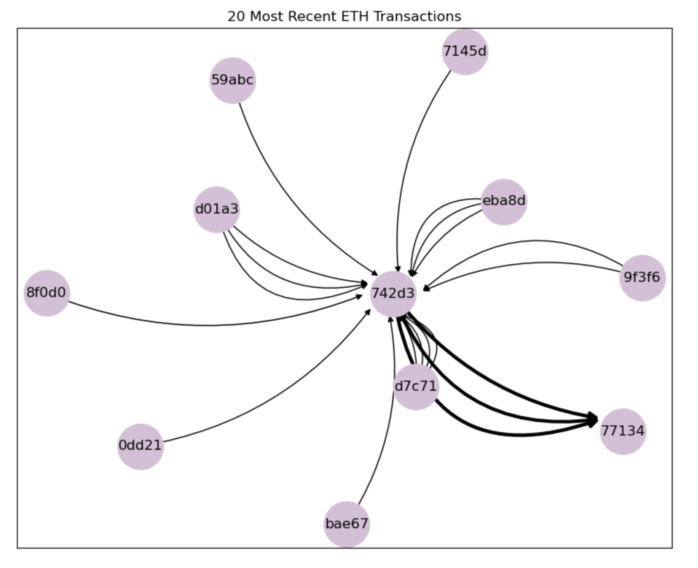
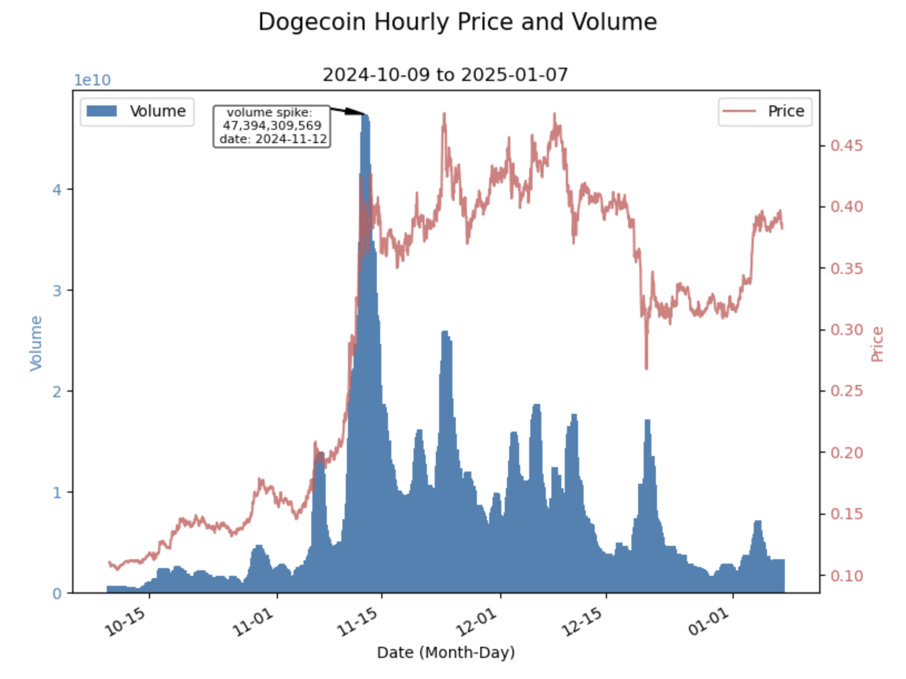
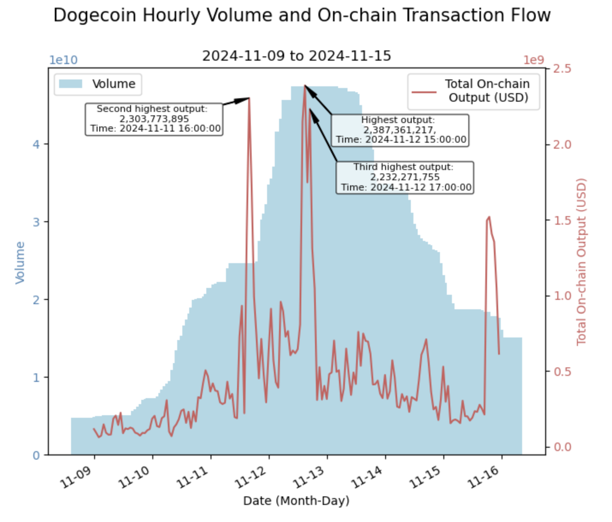
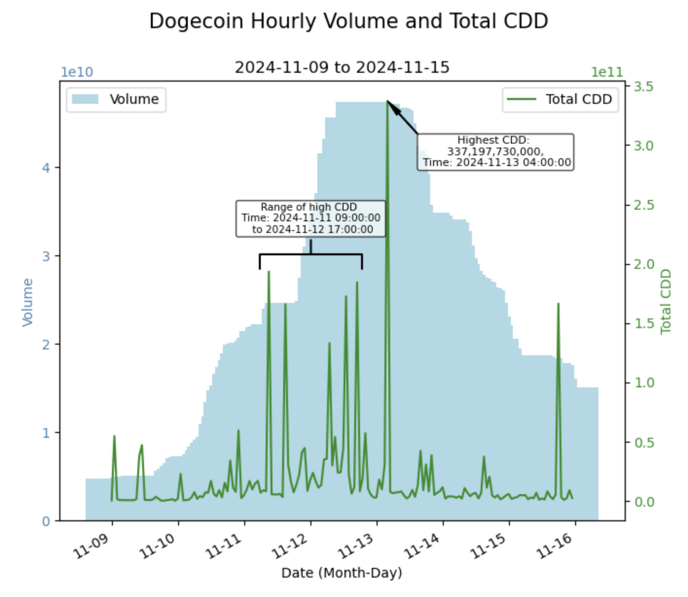
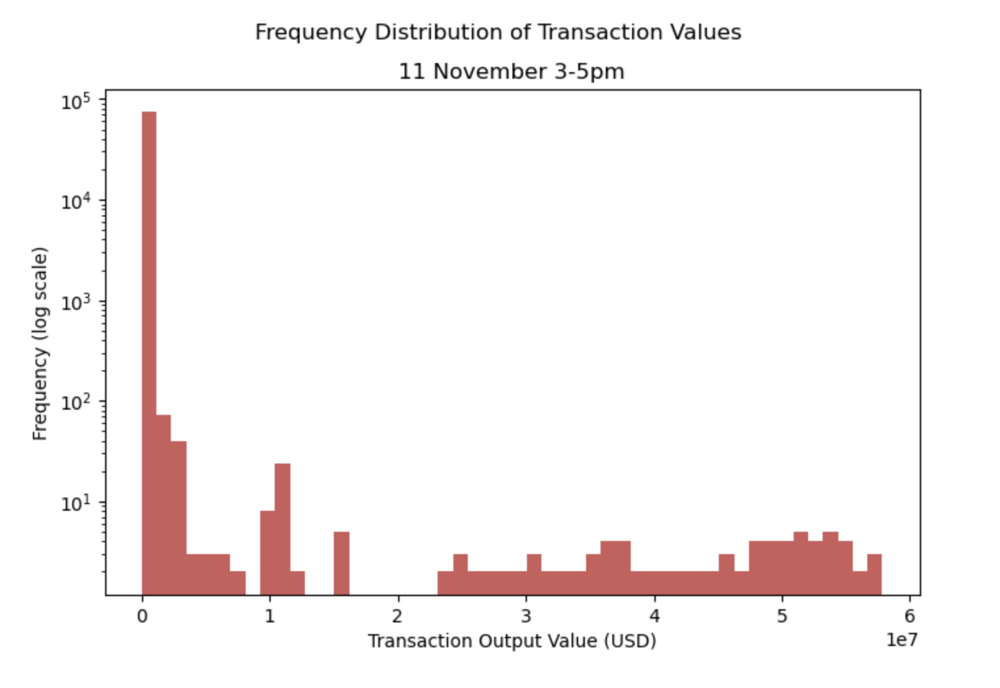
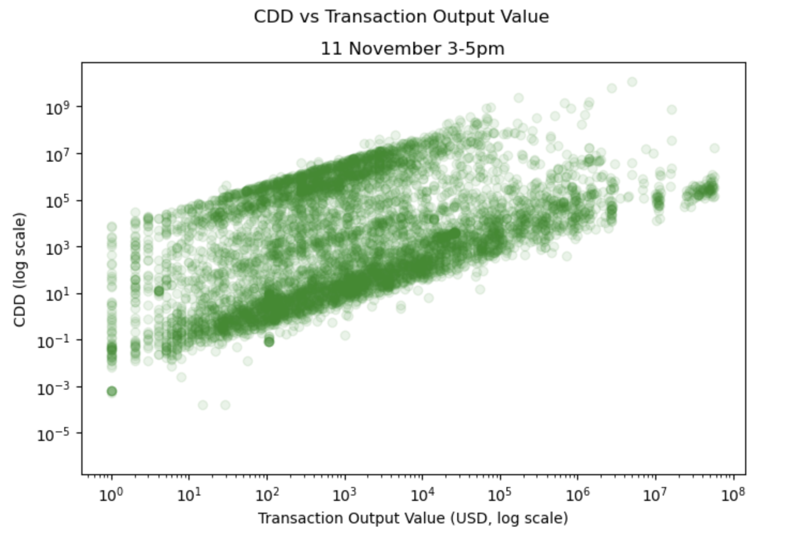
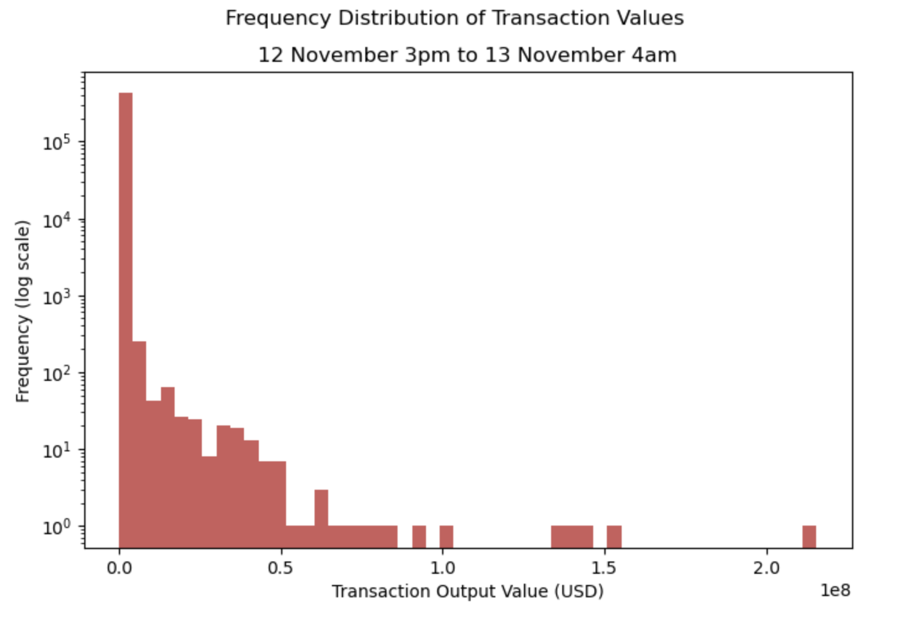

# Crypto Data Analysis Project

This repository contains two Jupyter notebooks that analyse different aspects of the cryptocurrency market using public APIs.

## Project Overview

This project consists of two separate analyses:

### Task One: Wallet Transactions

This notebook analyses the transaction history of a specific Ethereum whale wallet. It uses the Etherscan API (token required) to fetch up to 10,000 transactions for the wallet. The data is then processed and visualised as a bi-directional weighted graph of the 20 most recent transactions, with wallets as nodes and transactions as arrows. The thickness of the arrows is weighted by the transaction value.

### Task Two: Dogecoin Market Analysis

This notebook analyses Dogecoin's market data, including price and volume. It fetches data from the CoinGecko API for a specific date range. The data is cleaned and visualised using a time series plot that displays both price and volume, with annotations for key events.

## Repository Structure
```
├── data/               # Raw and processed datasets
├── images/             # Screenshots of visualisations
├── notebooks/          # Jupyter notebooks for analysis
│   └── task_one.ipynb
│   └── task_two.ipynb
├── .env                # Create this
├── requirements.txt    # Dependencies
└── README.md           # This file
```

## Requirements
To run the notebooks, you need to install the following Python libraries. It is recommended to use the provided `requirements.txt` file to set up a virtual environment.

```
requests==2.32.5
pandas==2.3.2
numpy==2.3.3
python-dotenv==1.1.1
networkx==3.5
matplotlib==3.10.6
```

You can install these dependencies by running:

```bash
pip install -r requirements.txt
```

## Installation

### 1. Clone the repository

```bash
git clone https://github.com/louisechuayn/crypto-assessment.git
cd crypto-assessment
```

### 2. Install dependencies

```bash
pip install -r requirements.txt
```

### Set up API keys

Task One: Create a `.env` file in the project directory and add your Etherscan API key as `ETHERSCAN_TOKEN=<your_api_key>`. This is necessary to fetch the transaction data.

```bash
echo "ETHERSCAN_TOKEN=<your_api_key>" > .env
```

Task Two: The CoinGecko API does not require a key for this specific request.

### Run the notebooks

Open `task_one.ipynb` and `task_two.ipynb` in a Jupyter environment.

Run the cells in each notebook to see the data fetching, processing, and visualisations.

**Note: There are some code chunks in `task_two.ipynb` that fetch data using APIs and might be slow to run. An alternative would be to skip that chunk and run the following chunk that reads that data in from an existing .csv file.**

## Data Sources

Etherscan API: Used in `task_one.ipynb` to retrieve Ethereum blockchain data.

CoinGecko API: Used in `task_two.ipynb` to retrieve cryptocurrency market data.

## Results

### Task One: Wallet Transactions
The 20 most recent transactions involving a famous ETH whale wallet was plotted as a bi-directional, multi-edged weighted, using nodes to represent wallets, directed edges to represent transactions, and edge weights to represent size of transaction.



### Task Two: Dogecoin Forensics Analysis

Dogecoin hourly price and volume data was plotted for a 90-day window.



Zooming into a week of interest, data was obtained for on-chain transactions and the hourly volume and total output in transactions was plotted.



The relationship between hourly volume and CDD (Coins Days Destroyed) was also investigated.



Zooming further inwo 2 shorter periods of interest to investigate if illicit activity (possible pump and dump) could have caused the volume spikes. A histogram of the frequency of transaction output values was plotted to better understand if these spikes were caused by many small transactions or one large transaction.





